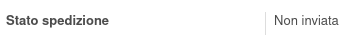
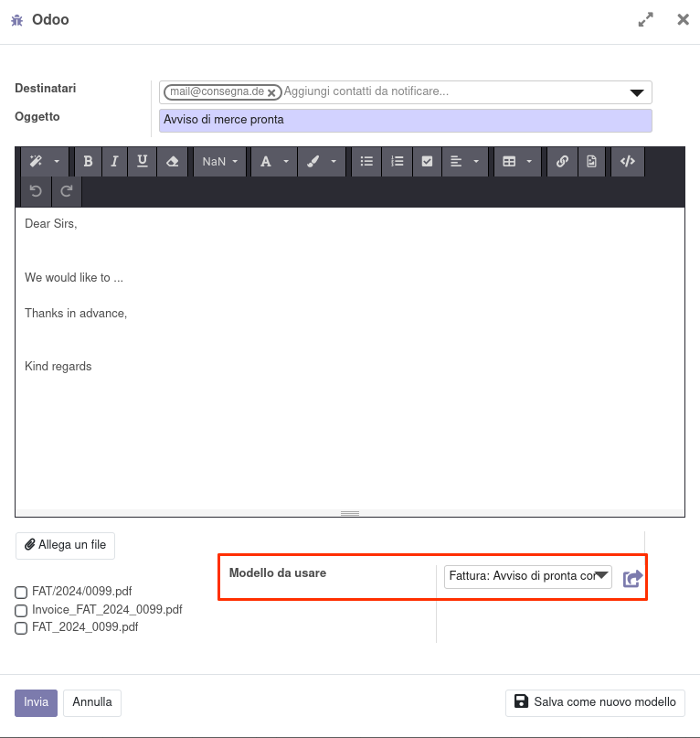
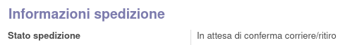
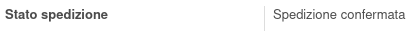
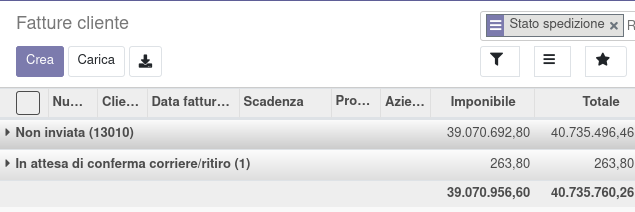

Usare il bottone *Contatta per spedizione* nella fattura per inviare una
mail di avviso:

che è visibile quanto lo stato dell'avviso è *Non inviata*:

Nel caso nell'indirizzo di consegna scelto in fattura oppure nel cliente
sia impostato un modello di mail per l'avviso di merce pronta, sarà
utilizzato in automatico:

A seguito dell'invio, lo stato del contatto per la spedizione sarà *In
attesa di conferma corriere/ritiro*:

E si potrà usare il bottone per confermare che la spedizione è stata
organizzata:

Lo stato passerà quindi in *Spedizione confermata*:

Si potrà nel mentre raggruppare o filtrare le fatture per controllare lo
*Stato spedizione*:

