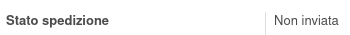
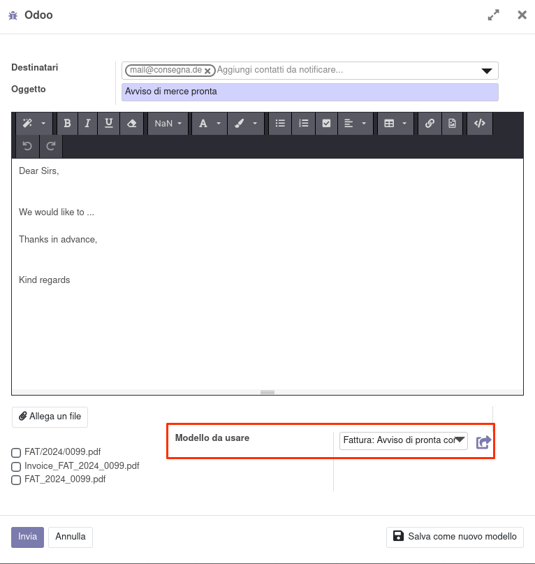
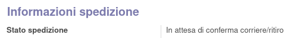
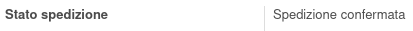

Usare il bottone *Contatta per spedizione* nella fattura per inviare una mail di avviso:

che è visibile quanto lo stato dell'avviso è *Non inviata*:

Nel caso nel cliente sia impostata un modello di mail per l'avviso di merce pronta, sarà utilizzato in automatico:

A seguito dell'invio, lo stato del contatto per la spedizione sarà *In attesa di conferma corriere/ritiro*:

E si potrà usare il bottone per confermare che la spedizione è stata organizzata:

Lo stato passerà quindi in *Spedizione confermata*:

