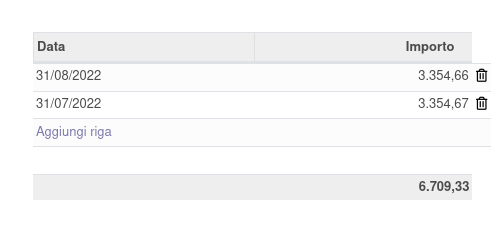

Le scadenze presenti nella e-invoice ricevuta vengono riportate nelle righe scadenze fattura, in modo da essere poi utilizzate per creare le scadenze corrette. È possibile modificare questi valori creati automaticamente nelle fatture fornitori nel tab Altre informazioni:

