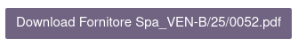

Va inserita nel modello di email questa stringa:

.. code-block:: xml

  ${object.fatturapa_attachment_out_id.get_url_report()}

Esempio completo di un possibile bottone per scaricare il file:

.. code-block:: xml

  <a href="${object.fatturapa_attachment_out_id.get_url_report()}" class="btn btn-lg btn-primary" style="text-decoration:none; border-radius:2px; border-style:none; padding:0.5rem 1rem 0.5rem 1rem; font-family:-apple-system, HelveticaNeue, &quot;Helvetica Neue&quot;, Helvetica, Arial, &quot;Lucida Grande&quot;, sans-serif; line-height:1.5; font-size:1.25rem; vertical-align:middle; text-align:center; font-weight:normal; display:inline-block; background-color:rgb(112, 100, 130); color:rgb(255, 255, 255)">Download ${"%s_%s.pdf" % (object.partner_id.name, object.name)}</a>

Che apparirà come un altro bottone:

