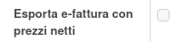
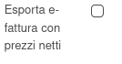
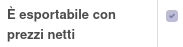

Questo modulo aggiunge nel partner, nella fattura e nell'azienda il campo "Esporta e-fattura con prezzi netti", in modo da evitare di mostrare gli sconti applicati.

Questo il campo nella fattura, che permette di configurarlo specificamente per fattura nel caso non sia impostato il campo (vedi sotto) sull'azienda o sul partner:

.. image:: ../static/description/esporta_prezzi_netti_fattura.png
    :alt: Esporta con prezzi netti in fattura

Questo il campo nel partner, che permette di configurarlo specificamente per partner nel caso non sia impostato il campo (vedi sotto) sull'azienda:

Questo il campo nella configurazione delle e-fatture nella contabilità, che se impostato viene quindi configurato per tutti i partner:

Ogni fattura ha una verifica di sicurezza, per eventuali problemi di decimali, che viene riportata nel campo "È esportabile con prezzi netti" visibile in fattura. Nel campo questo campo sia `False` non è possibile esportare la fattura senza gli sconti visibili.

