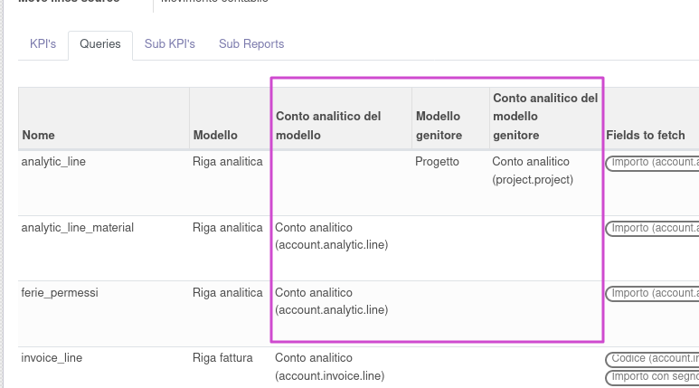

Configure Mis Builder Report as usual.

In Accounting > Configuration > MIS Reporting > MIS Report Templates configure only Model Analytic Account if exists, else configure Parent Model and Parent Model Analytic Account:

