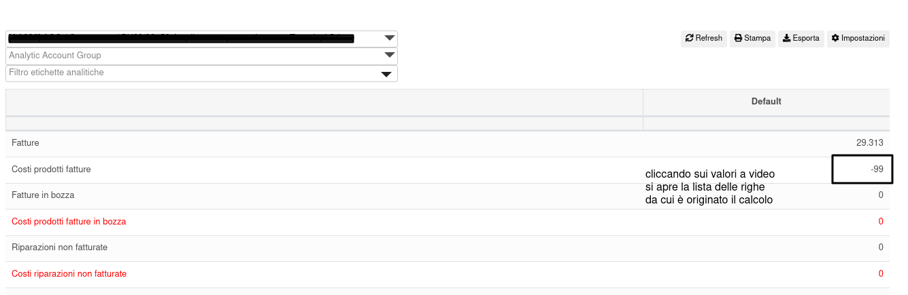
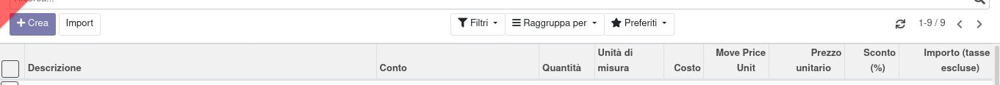

Nel report generato dal mis builder è possibile cliccare sul valore delle voci calcolate:

da cui verrà aperta la vista relativa filtrata e con dei campi aggiuntivi utili per il calcolo dei costi:

