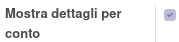
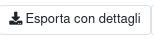
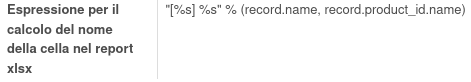

Impostando i campi di cui si vuole vedere il dettaglio tramite il check:

si ottiene l'esportazione dettagliata cliccando, a scelta, sul bottone presente nel report:

oppure su quello presente nella preview del report:

Il nome del campo di dettaglio viene impostato di default, si può decidere di impostarlo in maniera più precisa tramite il campo `Espressione per il calcolo del nome della cella nel report xlsx` nel KPI relativo:

