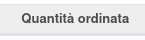

Nella riga del componente della produzione è stato aggiunto un campo per monitorare la quantità ordinata dello stesso, basato sugli ordini generati dalla produzione (o generati dalle richieste d'acquisto) (o collegati alle richieste d'acquisto se già esistenti):

La funzione di riserva dei prodotti è stata modificata in modo che consideri anche lo stock (anche se i componenti sono ordinati con MTO) e le quantità ordinate non ancora ricevute (attualmente considera solo i prodotti ricevuti), con effetto sul campo "Quantità riservata", solo per le righe dei componenti della produzione.

Per rendere l'aggiornamento automatico, è stato aggiunto un cron che riserva le produzioni ogni notte per allineare le quantità riservate.
