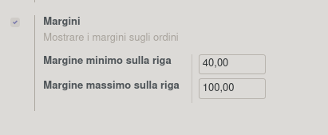
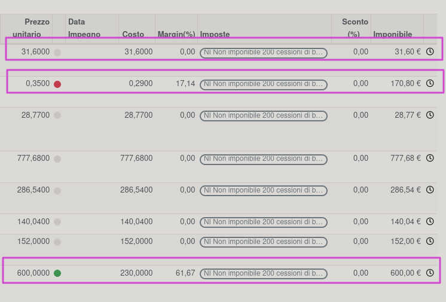

Nella configurazione vendite vengono aggiunti due campi in cui impostare
il margine minimo e quello massimo ritenuti congrui per le righe di
ordine di vendita:

Nelle righe di ordine di vendita è stato aggiunto un pallino di colore:
\# verde se entro i margini minimo e massimo \# rosso se inferiore al
margine minimo e superiore a zero \# grigio se il margine non è
impostato o superiore al massimo

