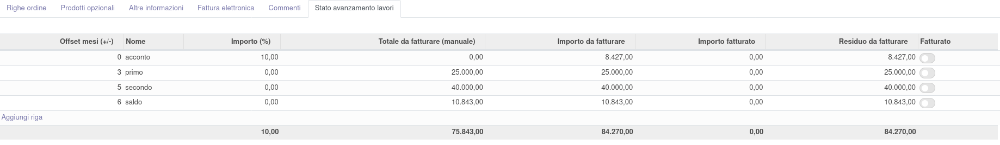
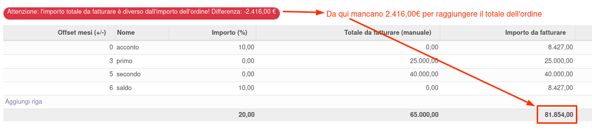
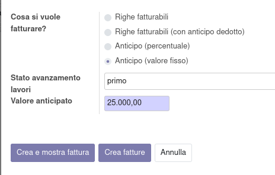
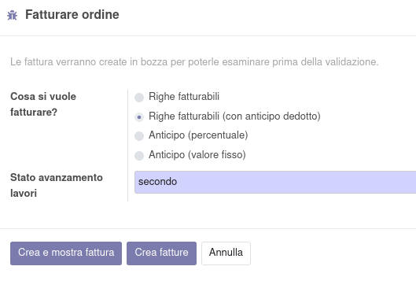
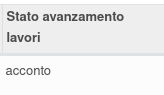
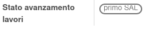
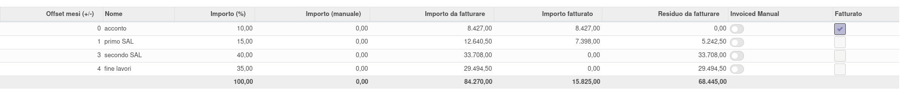

Nell'ordine di vendita è stato aggiunta una tab per gestire gli stati di avanzamento lavori, intesi come date in cui verranno effettuate delle fatture, sia per acconti che per beni/servizi forniti.

Su queste righe è possibile inserire quindi i valori che si presume verranno fatturati e a quanti mesi dal mese della data di impegno dell'ordine.
Si può inserire, alternativamente, un valore percentuale sul totale dell'ordine, oppure un valore fisso, avendo cura di raggiungere comunque un totale pari a quello dell'ordine.
Nel caso il valore non combaci, verrà segnalato:

Ad ogni fatturazione sarà quindi possibile scegliere quale stato di avanzamento lavori si sta fatturando.

Nel caso di fatturazione di un acconto, verrà inserito in automatico il valore % o assoluto da fatturare impostato nella riga dello stato di avanzamento lavori.

In caso invece di fatturazione di beni/servizi, il sistema richiede l'inserimento dello Stato di avanzamento lavori a cui abbinare le righe da fatturare e verrà creata la fattura come al solito:

Nelle righe generate sarà visibile lo stato di avanzamento lavori scelto:

Mentre nelle righe dell'ordine di vendita saranno visibili gli stati di avanzamento lavori collegati:

Questa è la situazione che si presenta dopo aver emesso una fattura di acconto collegata allo stato di avanzamento lavori Acconto e una di beni/servizi collegata allo stato di avanzamento lavori Primo SAL:

