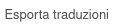
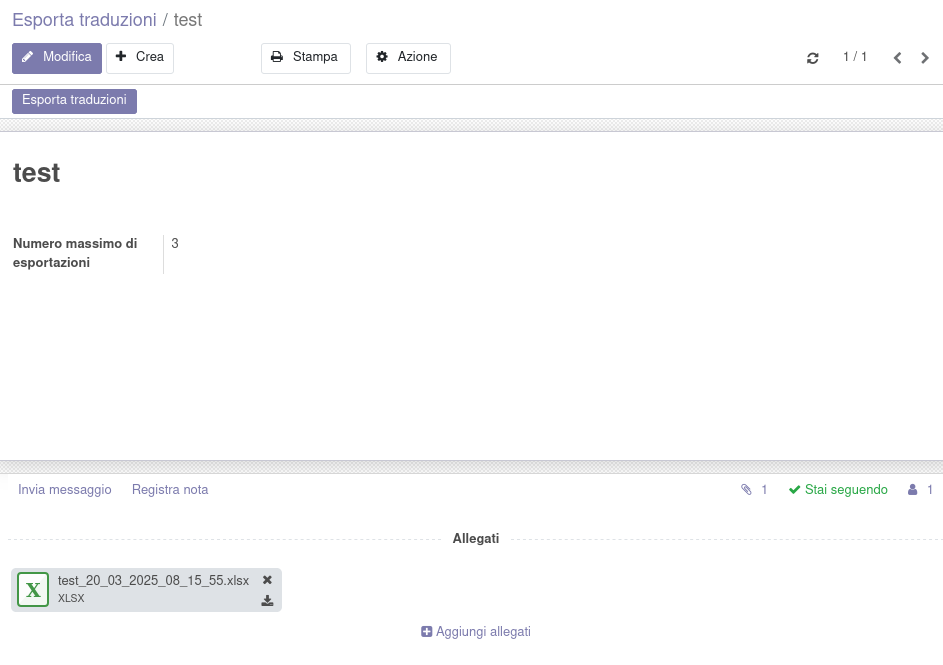
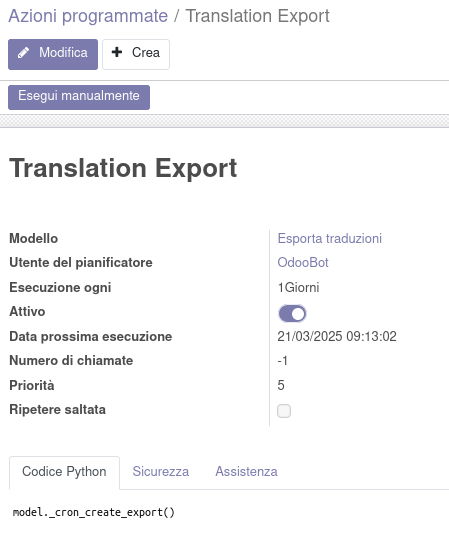
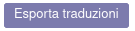
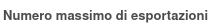

Nella configurazione del magazzino viene aggiunto un menu:

In cui si può creare una voce per esportare manualmente tramite il bottone a video o automaticamente tramite il cron sottoindicato una traduzione dei nomi dei prodotti. La traduzione viene salvata negli allegati del record, visibili sotto.

L'esportazione può essere forzata tramite questo bottone:

Il numero massimo di esportazioni salvate può essere ridotto modificando il valore di questo campo:

